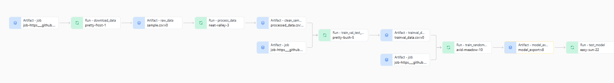

# Build ML model and pipeline for short term rental prices

- The purpose of this project is to predict and build ML pipeline for short term rental prices in NYC. This is part of Udacity ML DevOps Engineer Nanodegree program. 

## Project Description
A property management company, like Airbnb, rents rooms and properties for short periods of time on various rental platforms. They need to estimate the typical price for a given property based on the price of similar properties. The company receives new data in bulk every week. The model needs to be retrained with the same cadence, necessitating an end-to-end pipeline that can be reused.

### Configuration and Dependencies
- All required dependencies are mentioned in the environment.yml file
- The parameters controlling the pipeline are defined in the ``config.yaml`` file defined in
the root. Hydra will be used to manage this configuration file. 
- Running this project requires having an account of wandb (weight and bias or W&B) 

### Installation
The only dependency needed is mlflow which will take care of all other packages installed for each self contained environment. It can be installed using the package manager pip to install

`pip install mlflow`

### Artifacts and components storage in W&B
Building a reproducible ML pipeline requires different components and artifacts. They need to be contained in there own environment with their own version. The following image shows the pipeline contained within weights and biases. The information of this can be found here at the W&B site. [text](https://wandb.ai/nayeem-ahsan/nyc_airbnb/overview?nw=nwusermnahsan21)

### Running the entire pipeline 
In order to run the pipeline, we need to be in the root, then, use the following command:

`mlflow run .`

### Running different portions of pipeline separately
All steps need to be run at the root direcroty except the EDA step. 

#### get_data
This step uploads the data from local path to W&B.

`mlflow run . -P hydra_options="main.execute_steps='get_data'"`

#### Exploratory Data Analysis (EDA)
Jupyter notebook for the EDA. This needs to be run at the EDA folder directory. 

`mlflow run .`

#### preprocess
This step cleans the raw data based on the EDA. 

`mlflow run . -P hydra_options="main.execute_steps='preprocess'"`

#### check_data
This step verifies the data after the cleaningp process. 

`mlflow run . -P hydra_options="main.execute_steps='check_data'"`

#### train_test_split
This step split the data set into train and test data set. The test size can configured from the congif file. 

`mlflow run . -P hydra_options="main.execute_steps='train_test_split'"`

#### train_model
The project used randon forest to train the model.

`mlflow run . -P hydra_options="main.execute_steps='train_model'"`

#### Hyperparamter Optimization 
Hydra is used for the hyperparamter optimization. Also, joblib is used for parallel processing. 

`mlflow run . -P hydra_options="hydra/launcher=joblib  main.execute_steps='train_model' random_forest_pipeline.random_forest.max_features=0.1,0.33,0.5,0.75,1 random_forest_pipeline.tfidf.max_tfidf_features=10,15,30 -m"`

#### evaluation
This step tests the model against the test data.

`mlflow run . -P hydra_options="main.execute_steps='evaluate'"`

### Run the pipeline directly from github 
The pipeline can be run directly from this github to train different dataset. Example of a such commad line is:

`mlflow run https://github.com/NayeemAhsan/build-ML-model-and-pipeline-for-short-term-rental-prices.git \
           -v 1.0.0 \
           -P hydra_options="data.file_url='https://github.com/udacity/build-ml-pipeline-for-short-term-rental-prices/blob/main/components/get_data/data/sample2.csv?raw=true'"`

### License
Distributed under the MIT License. See LICENSE for more information.